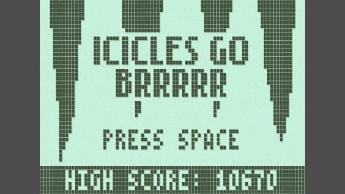

# Icicles Go Brrrrr

Icicle dodging game created in Godot 4 for [Nokia 3310 Jam 6](https://itch.io/jam/nokiajam6). Avoid the falling icicles, collect coins, and go for the highest score!

### https://qowface.itch.io/icicles-go-brrrrr

## Controls

| Input | Action |
| --- | --- |
| Left  Arrow / A / Numpad 4 | Move Left |
| Right Arrow / D / Numpad 6 | Move Right |
| Space / Up Arrow / W / Numpad 8 | Jump / Confirm |
| Enter / P / Numpad 0 | Pause |

## Credits

- Trix Sound Pack by [@Trix](https://twitter.com/Trixelized)
    - Downloaded from the [Nokia Jam Resources page](https://phillipp.itch.io/nokiajamresources)
- Godot 4.2 Starter Project by [@eptwalabha](https://github.com/Eptwalabha)
    - https://github.com/Eptwalabha/template-nokiajam
    - Includes the nokiafc22.ttf font by [Zeh Fernando](https://portfolio.zehfernando.com/) which is available free on [dafont.com](https://www.dafont.com/nokia-cellphone.font)
    - Includes the lowrez.png font also by [@eptwalabha](https://github.com/Eptwalabha)
